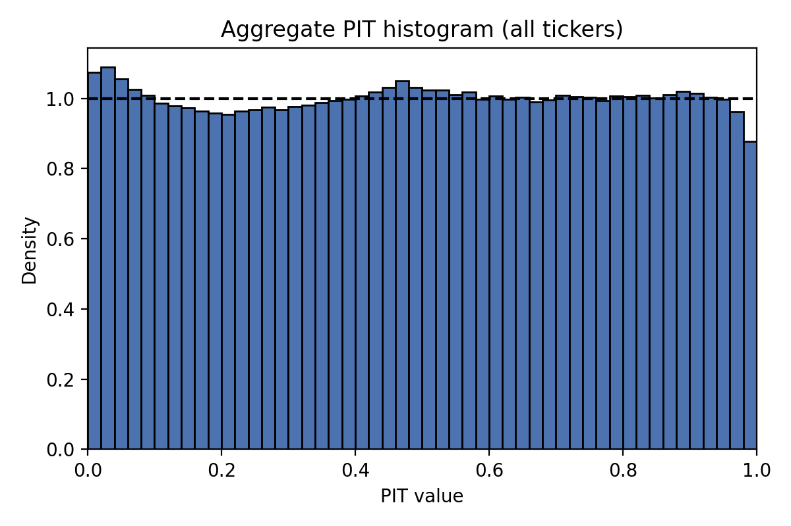
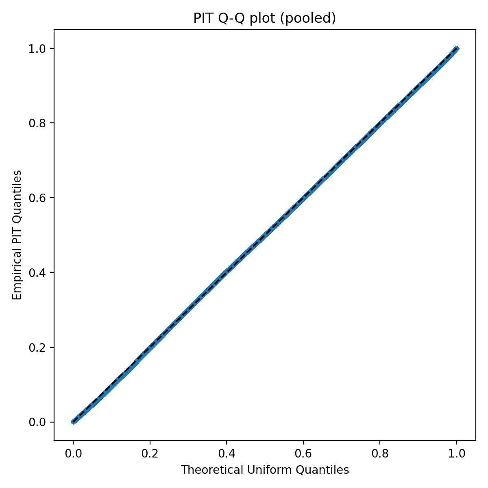
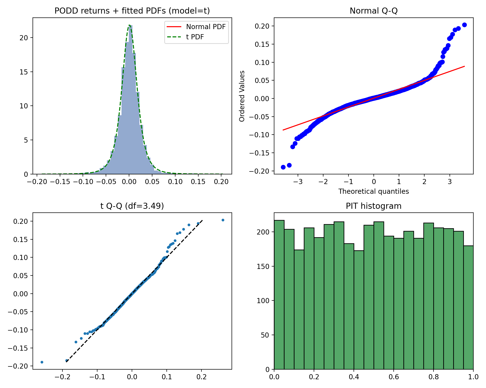
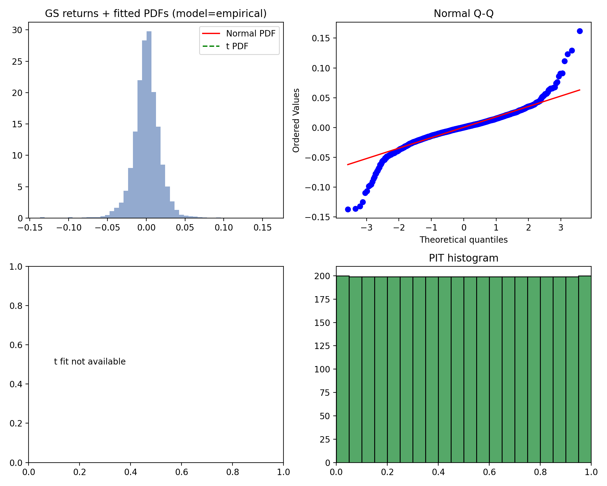

# Copula-Based Portfolio Risk Modeling Using S&P 500 Constituents

Team members: Yue Yang, Ziran Guo, Yuxi Geng, Qinqin Huang

## 1. Introduction and Objective

Traditional Value-at-Risk (VaR) estimation methods often rely on simplifying assumptions such as normally distributed returns or independence among asset returns. However, in real financial markets, asset returns exhibit non-linear dependence and tail co-movements that such models fail to capture.

This project proposes to develop a portfolio VaR estimation framework based on copula models using daily return data of S&P 500 constituent stocks. The key objective is to model the joint dependence structure accurately, particularly in the tails, and to evaluate whether copula-based VaR improves risk estimation over the assumption of independence. The performance of the model will be assessed via traffic light backtesting methods.

The specific steps include:

- Data collection and preprocessing of daily returns for S&P 500 stocks.
- Fitting marginal distributions to individual stock returns.
- Constructing elliptical copula models (Gaussian, Student-t) to capture dependencies.
- Simulating portfolio returns using the fitted copula and marginal distributions.
- Estimating VaR at different confidence levels from the simulated returns. 
- Backtesting how many times actual losses exceed predicted VaR and evaluating model performance by comparing with benchmarks assuming independence among assets.

## 2. Methodology

### 2.1 Data Preparation

We downloaded stock prices from yahoo finance and transformed to lognormal return rates. Data ranges from 2010-01-01 to 2025-11-03. Missing log return values are filled with 0.

### 2.2 Marginal Distribution Modeling

For each stock's daily log-returns, fit candidate univariate distributions (Normal / Student‑t / Empirical), select the best one with information criteria and goodness-of-fit tests, and transform series using the Probability Integral Transform (PIT) to obtain Uniform(0,1) margins.

#### 2.2.1 Univariate Normal Distribution
We treat the Normal (Gaussian) distribution as a parametric candidate with location parameter \(\mu\) and scale parameter \(\sigma>0\). The probability density function (pdf) is

$$
f(x;\mu,\sigma)=\frac{1}{\sigma\sqrt{2\pi}}\exp\left(-\frac{(x-\mu)^2}{2\sigma^2}\right),
$$

and the cumulative distribution function (CDF) is the standard Normal CDF shifted and scaled:

$$
F(x;\mu,\sigma)=\Phi\left(\frac{x-\mu}{\sigma}\right).
$$

For independent observations \(x_1,\dots,x_n\) the log-likelihood is

$$
\ell(\mu,\sigma)=\sum_{i=1}^n \ln f(x_i;\mu,\sigma) = -\frac{n}{2}\ln(2\pi)-n\ln\sigma -\frac{1}{2\sigma^2}\sum_{i=1}^n (x_i-\mu)^2.
$$

The MLEs are closed-form:

$$
\hat{\mu}=\bar{x}=\frac{1}{n}\sum_{i=1}^n x_i,\qquad \hat{\sigma}^2=\frac{1}{n}\sum_{i=1}^n (x_i-\bar{x})^2.
$$

We transform observed returns to PIT (Uniform(0,1)) via the fitted CDF:

$$
U_i=F(x_i;\hat{\mu},\hat{\sigma})=\Phi\left(\frac{x_i-\hat{\mu}}{\hat{\sigma}}\right).
$$

In practice we clip PIT values to \((\varepsilon,1-\varepsilon)\) with a small \(\varepsilon\) (here \(10^{-6}\)) to avoid exact 0 or 1 that would cause numerical issues when inverting marginals during simulation.
#### 2.2.2 Univariate t-Distribution
The univariate Student‑t distribution with degrees of freedom \(\nu>0\), location \(\mu\) and scale \(\sigma>0\) has pdf

$$
f(x;\nu,\mu,\sigma)=\frac{\Gamma\left(\frac{\nu+1}{2}\right)}{\Gamma\left(\frac{\nu}{2}\right)\sqrt{\nu\pi}\,\sigma}\left(1+\frac{1}{\nu}\left(\frac{x-\mu}{\sigma}\right)^2\right)^{-\frac{\nu+1}{2}}.
$$

Its heavier tails (relative to the Normal) are controlled by \(\nu\); as \(\nu\to\infty\) the t distribution converges to the Normal. There is no simple closed-form MLE for all parameters simultaneously; numerical MLE (e.g. `scipy.stats.t.fit`) is used to obtain \(\hat{\nu},\hat{\mu},\hat{\sigma}\). The log-likelihood is

$$
\ell(\nu,\mu,\sigma)=\sum_{i=1}^n \ln f(x_i;\nu,\mu,\sigma).
$$

We obtain PIT values via the fitted t CDF:

$$
U_i=F_{t,\hat{\nu}}\left(\frac{x_i-\hat{\mu}}{\hat{\sigma}}\right)
$$

and apply the same clipping \((\varepsilon,1-\varepsilon)\) as above. In model selection the t candidate is preferred when information criteria (AIC/BIC) favor it or when diagnostics indicate heavy tails (small estimated \(\hat{\nu}\)) that materially improve fit.
#### 2.2.3 Univariate Empirical Distribution
The empirical (nonparametric) CDF for a sample \(\{x_1,\dots,x_n\}\) is the empirical distribution function (ECDF)

$$
\hat{F}_n(x)=\frac{1}{n}\sum_{i=1}^n \mathbf{1}\{x_i\le x\}.
$$

To construct PIT values that avoid exact 0 and 1 we use a plotting-position formula. If \(r_i\) is the rank of \(x_i\) (1 = smallest), the plotting-position PIT is

$$
U_i=\frac{r_i-\tfrac{1}{2}}{n}.
$$

This rank-based transform preserves the empirical tail behavior without imposing a parametric shape and is used when both parametric candidates are deemed inadequate by GOF diagnostics. As above, values are clipped to \((\varepsilon,1-\varepsilon)\) prior to copula estimation and simulation.
#### 2.2.4 Selecting the Best Fit
Selecting the best marginal per ticker combines likelihood‑based information criteria, distributional goodness-of-fit tests, and practical heuristics. The formal elements are:

- Information criteria
  - Akaike Information Criterion (AIC):

  $$
  \mathrm{AIC}=2k-2\ell(\hat{\theta}),
  $$

  where \(k\) is the number of estimated parameters and \(\ell(\hat{\theta})\) is the maximized log-likelihood. AIC estimates out-of-sample KL divergence (up to an additive constant) and penalizes model complexity linearly in \(k\).

  - Bayesian Information Criterion (BIC):

  $$
  \mathrm{BIC}=k\ln n - 2\ell(\hat{\theta}),
  $$

  where \(n\) is the sample size. BIC penalizes complexity more strongly for larger samples and is consistent (selects the true model with probability →1 when the true model is among candidates and n→∞).

  We compute both criteria for each parametric candidate and prefer models with lower AIC and/or BIC. In implementation we compare combined evidence (for robustness) but either criterion may be decisive depending on sample size.

- Goodness-of-fit (GOF) tests
  - Kolmogorov–Smirnov (KS) statistic: for fitted CDF \(F\) and empirical CDF \(\hat{F}_n\),

  $$
  D_n=\sup_x |\hat{F}_n(x)-F(x)|.
  $$

  The KS test assesses maximum deviation; small p-values indicate the parametric CDF is unlikely to have generated the data.

  - Cramér–von Mises (CvM) statistic: an L2 measure of discrepancy,

  $$
  W_n= n\int (\hat{F}_n(x)-F(x))^2\,dF(x),
  $$

  which is more sensitive to deviations across the whole support (including tails) than the KS statistic.

  We compute p-values for both tests under the fitted null. If both parametric candidates are strongly rejected (p-values below a chosen threshold such as 0.05), we prefer the empirical marginal.

- Practical heuristics and safeguards
  - Minimum sample size: extremely short series are skipped because parameter estimates and test statistics are unreliable.
  - Tail bias toward Student‑t: when the estimated degrees-of-freedom \(\hat{\nu}\) for the t-distribution is small (indicating heavy tails) we may prefer t even when information criteria differences are modest.
  - Numerical guards: enforce lower bounds on scale parameters and on \(\nu\) to avoid degenerate fits and ensure finite variance where required.

Operationally, the routine `run_fitting` computes log-likelihoods, AIC, BIC, KS and CvM p-values for the Normal and t candidates, and falls back to the empirical PIT when both parametric fits are rejected. The chosen model and parameter estimates are recorded in `best_table`; the per-ticker PITs (Uniform(0,1)) are collected into `pit_df`, and these objects are used as inputs for copula parameter estimation and simulation.
### 2.3 Fitting Copulas to Data

#### 2.3.1 Gaussian Copula

Gaussian copula assumes that the correlation structure of multivariates is linear and can be captured by a multivariate normal distribution. The key parameter to estimate is the correlation matrix $\Sigma$.

We can either use the Pearson correlation matrix or the Kendall's tau matrix to estimate the correlation matrix for the Gaussian copula. However, the Kendall's tau matrix is more robust to outliers so we will use it in this project. 

Assume we have $n$ assets with historical log returns data. Let $F_i$ be the empirical CDF of the log returns for asset $i$.

The steps to fit a Gaussian copula are as follows:

1. Compute the empirical Kendall's tau matrix from the empirical df of the log returns.

$$
\tau_{ij} = P((F_i - F_i')(F_j - F_j') > 0) - P((F_i - F_i')(F_j - F_j') < 0)
$$

Where $(F_i', F_j')$ is an independent copy of $(F_i, F_j)$.


2. Convert the Kendall's tau matrix to the correlation matrix using the relation:

    $$
    \rho_{ij} = \sin\left( \frac{\pi}{2} \tau_{ij} \right)
    $$

  $\rho_{ij}$ is the $(i,j)$-th entry of the correlation matrix $\Sigma$.

#### 2.3.2 t Copula

The Gaussian copula is simple but may not capture tail dependencies well. The t copula can model stronger sysmetric tail dependence. In other words, t copula can capture heavier tails in both lower and upper tails.

The correlation matrix for the t copula is estimated in the same way as the Gaussian copula using the Kendall's tau matrix.
The degrees of freedom parameter $\nu$ can be estimated using maximum likelihood estimation (MLE) or method of moments based on the empirical data.

The log-likelihood function for the t copula is given by:

$$
ln L(\nu; \Sigma, \hat{U}_1, \hat{U}_2, \dots, \hat{U}_n) = \sum_{t=1}^{n} \ln g_{\nu, \Sigma}(t_{\nu}^{-1}(\hat{U}_{t, 1}), t_{\nu}^{-1}(\hat{U}_{t, 2}), \dots, t_{\nu}^{-1}(\hat{U}_{t, d})) - \sum_{i=1}^{d} \sum_{t=1}^{n} \ln g_{\nu}(t_{\nu}^{-1}(\hat{U}_{t, i}))
$$

Where,
- $\hat{U}_{t} = (U_{t, 1}, U_{t, 2}, \dots, U_{t, d}) = (\hat{F}_1(X_{t, 1}), \hat{F}_2(X_{t, 2}), \dots, \hat{F}_d(X_{t, d}))$ are the pseudo-observations.
- $t_{\nu}^{-1}$ is the inverse CDF of the univariate t distribution with $\nu$ degrees of freedom.
- $g_{\nu, \Sigma}$ is the joint density of a random vector with $t_d(\nu, 0, \Sigma)$ distribution.


### 2.4 Simulate Paths

To estimate VaR using copula models, we will simulate multiple paths of portfolio returns based on the fitted copula and marginal distributions.

Assume we have $n$ assets in the portfolio and we want to simulate $N$ scenarios of portfolio returns over $m$ days.

#### 2.4.1 Gaussian Copula

Steps to simulate portfolio returns using Gaussian copula:

1. Generate $n times m$ matrix of independent standard normal variables $Z$.
2. Apply Cholesky decomposition to the correlation matrix $\Sigma$ obtained from the historical returns to get a lower triangular matrix $L$ such that $\Sigma = LL^T$.
3. Transform the independent standard normal variables to correlated normal variables: $Y = ZL^T$.
4. Convert the correlated normal variables to uniform variables using the standard normal CDF: $U_{ij} = \Phi(Y_{ij})$ for $i = 1, ..., n$ and $j = 1, ..., m$.
5. Invert the uniform variables to the original marginal distributions using the inverse CDF (quantile function) of each asset's fitted marginal distribution: $X_{ij} = F_i^{-1}(U_{ij})$.
6. Repeat steps 1-5 for $N$ simulations to obtain $N$ scenarios of portfolio returns.


#### 2.4.2 Student-t Copula

Steps to simulate portfolio returns using Student-t copula:

1. Same as steps 1-3 in Gaussian copula.
2. Simulate $n \times m$ matrix of independent chi-squared variables $W$ with $\nu$ degrees of freedom.
3. Scale the correlated normal variables to obtain Student-t variables: $T_{ij} = Y_{ij} / \sqrt{W_{ij}/\nu}$.
4. Convert the Student-t variables to uniform variables using the Student-t CDF: $U_{ij} = t_{\nu}(T_{ij})$ for $i = 1, ..., n$ and $j = 1, ..., m$.
5. Invert the uniform variables to the original marginal distributions using the inverse CDF (quantile function) of each asset's fitted marginal distribution: $X_{ij} = F_i^{-1}(U_{ij})$.
6. Repeat steps 1-5 for $N$ simulations to obtain $N$ scenarios of portfolio returns.


### 2.5 VaR Estimation

### 2.6 Benchmark and Backtesting

## 3. Results

Since the program involves intensive computation and takes a long time to run, we only refit asset marginal distributions and copula models every year and simulate daily returns for the next year based on the fitted models. However, the VaR estimation and backtesting are done on a daily basis, in which we use a rolling window to calculate the VaR for the next few days (e.g., 10 days) and compare with the actual losses then count the number of exceedances over the testing period. Since the main focus is comparing the copula-based VaR with the independence assumption-based VaR rather than precise VaR values, this approximation is acceptable using yearly refitting.

In each refitting, we use the past 5 years of daily returns to fit the marginal distributions and copula models. The results below show the fitting results, simulated portfolio returns, VaR estimates, and backtesting results.

### 3.1 Distribution Fitting Results

The marginal-distribution fitting was run over the available return history and produced per-ticker model choices and PIT series.

**Model selection (counts)**

| Best Model | Count | Percent |
| ---------- | -----:| -------:|
| Student‑t  | 498   | 99.2%   |
| Empirical  | 4     | 0.8%    |
| Normal     | 0     | 0.0%    |

The vast majority of tickers (498 of 502) were best fit by a Student‑t marginal, with only four tickers requiring an empirical fit. No ticker in this run selected a Gaussian marginal under the AIC/BIC + GOF procedure.

**Parameter summary (Student‑t)**

- Degrees of freedom (\(\nu\)): mean = 3.3591, std = 0.3779, min = 2.01, median = 3.3491, max = 5.1234.
- Location (t_loc): mean ≈ 0.0007941 (daily), typical values near zero.
- Scale (t_scale): mean ≈ 0.01257 (daily volatility scale).

The small estimated degrees-of-freedom (median ≈ 3.35) indicate pronounced heavy tails in marginal return distributions, which explains the systematic preference for Student‑t marginals over Gaussian.

**PIT diagnostics (pooled across tickers)**

- Number of non-missing PIT observations: 1,888,093
- Mean(PIT) = 0.49854 (ideal = 0.5)
- Var(PIT) = 0.083285 (ideal = 1/12 ≈ 0.083333)
- Median(PIT) = 0.49972
- Proportion of PIT in (0.49, 0.51) ≈ 2.04%

These pooled diagnostics suggest the PITs are close to Uniform(0,1) on aggregate: mean and variance are very near the theoretical values, and the Q–Q diagnostics in Figure 1 confirm only modest deviations.


{width=600px}

*Figure 1: pooled PIT histogram over all tickers; the dashed line shows the uniform density.*

{width=600px}

*Figure 2: PIT Q–Q plot (pooled) vs theoretical Uniform(0,1); empirical quantiles close to the 45° line.*

{width=600px}

*Figure 3: example ticker panel (returns histogram with fitted PDFs, Q–Q plots, and PIT histogram).* 

{width=600px}

*Figure 4: alternate example fit for comparison.*

{width=600px}

*Figure 5: ticker where empirical (rank) marginal was used as fallback; shows empirical PIT behavior.*


- The near-universal selection of Student‑t marginals and the low estimated degrees-of-freedom motivate the use of a t‑copula (or other tail-dependent copulas) when modeling joint behavior since heavy marginal tails increase the likelihood of joint extremes.
- The small number of empirical fallbacks indicates the parametric candidate set (Normal, t) is adequate for almost all tickers; where empirical fits occur, they should be inspected individually and may reflect micro-capillars, short histories, or data issues.
- PIT diagnostics are satisfactory in aggregate but remain useful at the ticker level: non-uniform PITs for individual tickers can bias copula estimation and should be handled (e.g., longer windows, smoothed CDFs, or explicit nonparametric marginals) if problematic.


### 3.2 Copula Fitting Results

The following are the copula fitting results at each refitting date:

```plaintext
fitting date: 2020-01-08 00:00:00, copula: t, nu: 12.417756424535327
fitting date: 2021-01-08 00:00:00, copula: t, nu: 9.195719667646452
fitting date: 2022-01-10 00:00:00, copula: t, nu: 9.117256117881958
fitting date: 2023-01-12 00:00:00, copula: t, nu: 10.180435891793604
fitting date: 2024-01-17 00:00:00, copula: t, nu: 10.288289682819688
fitting date: 2025-01-21 00:00:00, copula: t, nu: 11.462445359219407
```

From the results, we can see that the t copula is consistently selected as the best-fitting copula model at each refitting date, indicating the presence of tail dependence among the asset returns. The estimated degrees of freedom parameter $\nu$ ranges from approximately 7.96 to 9.82, suggesting moderate tail heaviness in the joint distribution of asset returns.

The correlation matrices are too large to show here in full, but here are the snippets of the correlation matrices at each refitting date. We can see that the correlations among assets do not change significantly over time.

```plaintext
fitting date: 2020-01-08 00:00:00, correlation matrix:
[[1.         0.25135828 0.22668861 ... 0.2755526  0.36510618 0.18096865]
 [0.25135828 1.         0.19294253 ... 0.22807553 0.32770435 0.11335533]
 [0.22668861 0.19294253 1.         ... 0.21777834 0.31088217 0.45800343]
 ...
 [0.2755526  0.22807553 0.21777834 ... 1.         0.3645142  0.15124268]
 [0.36510618 0.32770435 0.31088217 ... 0.3645142  1.         0.28515786]
 [0.18096865 0.11335533 0.45800343 ... 0.15124268 0.28515786 1.        ]]

fitting date: 2021-01-08 00:00:00, correlation matrix:
[[1.         0.26263353 0.21670038 ... 0.26932472 0.33672786 0.16073783]
 [0.26263353 1.         0.23304742 ... 0.29520966 0.41469945 0.16328013]
 [0.21670038 0.23304742 1.         ... 0.2171963  0.30843546 0.47078713]
 ...
 [0.26932472 0.29520966 0.2171963  ... 1.         0.37279705 0.15226454]
 [0.33672786 0.41469945 0.30843546 ... 0.37279705 1.         0.26804008]
 [0.16073783 0.16328013 0.47078713 ... 0.15226454 0.26804008 1.        ]]

fitting date: 2022-01-10 00:00:00, correlation matrix:
[[1.         0.26520473 0.16530195 ... 0.2467958  0.26536886 0.12163457]
 [0.26520473 1.         0.24837493 ... 0.32711292 0.44485892 0.17722045]
 [0.16530195 0.24837493 1.         ... 0.17684218 0.25438244 0.45194714]
 ...
 [0.2467958  0.32711292 0.17684218 ... 1.         0.36129222 0.1092786 ]
 [0.26536886 0.44485892 0.25438244 ... 0.36129222 1.         0.21916796]
 [0.12163457 0.17722045 0.45194714 ... 0.1092786  0.21916796 1.        ]]

fitting date: 2023-01-12 00:00:00, correlation matrix:
[[1.         0.32303348 0.16946741 ... 0.29402492 0.2826605  0.15276508]
 [0.32303348 1.         0.30050247 ... 0.40269805 0.48868892 0.23283978]
 [0.16946741 0.30050247 1.         ... 0.20642493 0.27499455 0.47781056]
 ...
 [0.29402492 0.40269805 0.20642493 ... 1.         0.39341918 0.1329136 ]
 [0.2826605  0.48868892 0.27499455 ... 0.39341918 1.         0.24694012]
 [0.15276508 0.23283978 0.47781056 ... 0.1329136  0.24694012 1.        ]]

fitting date: 2024-01-17 00:00:00, correlation matrix:
[[1.         0.33219196 0.15426941 ... 0.27997159 0.27046316 0.13835175]
 [0.33219196 1.         0.30707339 ... 0.44573637 0.51498306 0.24933645]
 [0.15426941 0.30707339 1.         ... 0.18496381 0.26589756 0.46847979]
 ...
 [0.27997159 0.44573637 0.18496381 ... 1.         0.40843087 0.147931  ]
 [0.27046316 0.51498306 0.26589756 ... 0.40843087 1.         0.24424112]
 [0.13835175 0.24933645 0.46847979 ... 0.147931   0.24424112 1.        ]]

fitting date: 2025-01-21 00:00:00, correlation matrix:
[[1.         0.32144924 0.15336631 ... 0.27221015 0.25305857 0.14491005]
 [0.32144924 1.         0.30775105 ... 0.45122881 0.5131643  0.26961728]
 [0.15336631 0.30775105 1.         ... 0.17882451 0.25748707 0.47164354]
 ...
 [0.27221015 0.45122881 0.17882451 ... 1.         0.40739566 0.15282154]
 [0.25305857 0.5131643  0.25748707 ... 0.40739566 1.         0.24952815]
 [0.14491005 0.26961728 0.47164354 ... 0.15282154 0.24952815 1.        ]]
```


### 3.3 Simulated Portfolio Returns


Assume an equally weighted portfolio of all S&P 500 constituent stocks and calculate the 1% and 99% quantiles of the simulated portfolio returns at each refitting date. We can see that the copula-based simulations produce more extreme quantiles compared to the independence assumption, reflecting the impact of dependencies among asset returns.

```plaintext
fitting date: 2020-01-08 00:00:00, 
 independent 1% quantile: -0.00037, copula 1% quantile: -0.01014, 
 independent 99% quantile: 0.00180, copula 99% quantile: 0.01154
fitting date: 2021-01-08 00:00:00, 
 independent 1% quantile: -0.00065, copula 1% quantile: -0.01148, 
 independent 99% quantile: 0.00219, copula 99% quantile: 0.01308
fitting date: 2022-01-10 00:00:00, 
 independent 1% quantile: -0.00051, copula 1% quantile: -0.01067, 
 independent 99% quantile: 0.00214, copula 99% quantile: 0.01234
fitting date: 2023-01-12 00:00:00, 
 independent 1% quantile: -0.00061, copula 1% quantile: -0.01175, 
 independent 99% quantile: 0.00219, copula 99% quantile: 0.01335
fitting date: 2024-01-17 00:00:00, 
 independent 1% quantile: -0.00067, copula 1% quantile: -0.01213, 
 independent 99% quantile: 0.00214, copula 99% quantile: 0.01363
fitting date: 2025-01-21 00:00:00, 
 independent 1% quantile: -0.00063, copula 1% quantile: -0.01224, 
 independent 99% quantile: 0.00218, copula 99% quantile: 0.01378
```


### 3.4 VaR Estimates

We estimate 1-day 99% portfolio VaR for both the copula-based model and an independent-returns benchmark over 1,462 trading days from 2020-01-08 to 2025-01-21. For each refit date, we simulate multi-asset return paths, form an equally-weighted portfolio of the S&P 500 constituents, and take the 1% quantile of simulated portfolio returns as the VaR estimate. This produces two daily VaR series, denoted \( \mathrm{VaR}_t^{\text{copula}} \) and \( \mathrm{VaR}_t^{\text{indep}} \).

Over this sample, the level and distribution of the two VaR series differ sharply. The copula-based VaR is much more conservative, with an average 1-day VaR of about \(-3.16\%\) and a median of \(-3.15\%\); the 5th and 95th percentiles are roughly \(-3.98\%\) and \(-2.40\%\), and the most extreme values range from \(-5.21\%\) to \(-1.98\%\). By contrast, the independent-returns VaR is very tight around zero, with an average of about \(-0.20\%\), a median of \(-0.20\%\), and a 5–95% range of approximately \(-0.25\%\) to \(-0.13\%\). The difference \( \mathrm{VaR}_t^{\text{copula}} - \mathrm{VaR}_t^{\text{indep}} \) is always negative in our sample (mean ≈ \(-2.96\%\)), implying that on every day the copula model assigns a larger potential loss than the independent benchmark.

These differences in VaR levels are consistent with the exception statistics discussed in the backtesting section. Using 99% VaR, the copula model generates 33 exceptions over 1,462 days (about 2.3%), which is only slightly above the nominal 1% rate. In contrast, the independent-returns VaR produces 549 exceptions (about 37.6%), indicating a severe underestimation of tail risk. Together, the VaR estimates and exception rates suggest that the copula-based model captures joint downside risk much more realistically than the independent-returns benchmark.


### 3.5 Backtesting Results
To evaluate the out-of-sample performance of our 1-day 99% portfolio VaR, we apply the Basel traffic-light framework to simulated and historical returns. For each day we compare the realized equally-weighted S&P 500 portfolio return to two VaR models: a copula-based model that preserves the cross-sectional dependence across 503 assets, and a benchmark model that assumes assets are independent with the same marginal distributions. We then count “exceptions” – days when the realized loss is larger than the predicted 99% VaR – and classify 250-day windows into green (≤4 exceptions), yellow (5–9) and red (≥10) zones.

Over the five non-overlapping 250-day blocks from January 2020 to January 2024, the independent model performs very poorly: each block records between roughly 75 and 118 exceptions, far above the Basel upper bound of 9, so the independent VaR is always in the red zone. This indicates that ignoring dependence leads to severe underestimation of portfolio tail risk. The copula model performs substantially better. In three of the five 250-day blocks it produces zero exceptions, placing those windows firmly in the green zone and implying that the VaR is conservative in “normal” periods. However, in two stress-heavy blocks the copula model still generates 20 and 10 exceptions respectively, which pushes those windows into the red zone and reveals that the fitted dependence structure does not fully capture extreme joint moves observed during turbulent markets.

| Block | Period (start–end)      | # days | Copula: # exceptions | Copula TL | Indep.: # exceptions | Indep. TL |
| ----- | ----------------------- | ------ | -------------------- | --------- | -------------------- | --------- |
| 1     | 2020-01-08 – ~2020-??   | 250    | 20                   | **Red**   | 97                   | **Red**   |
| 2     | 2020-01-08 – 2021-01-08 | 250    | 0                    | **Green** | 75                   | **Red**   |
| 3     | 2021-01-08 – 2022-01-10 | 250    | 10                   | **Red**   | 118                  | **Red**   |
| 4     | 2022-01-10 – 2023-01-12 | 250    | 0                    | **Green** | 94                   | **Red**   |
| 5     | 2023-01-12 – 2024-01-17 | 250    | 0                    | **Green** | 83                   | **Red**   |


Aggregating over the entire backtest horizon (about 1,460 trading days from 2020-01-08 onward), the copula VaR records 33 breaches while the independent model records 549. Both models therefore fall into the red zone when viewed over the full sample, but the magnitude of improvement is clear: modeling dependence via a copula dramatically reduces, though does not eliminate, VaR violations. Overall, the backtest suggests that the copula-based approach is meaningfully more realistic than the independence benchmark and can provide useful risk estimates in typical market conditions, yet it remains vulnerable during extreme episodes, where additional features such as time-varying volatility, regime shifts or more flexible tail dependence would likely be needed to achieve regulatory-grade performance.

# Note

1. We referrenced text book - "Quantitative Risk Management: Concepts, Techniques and Tools" by Alexander J. McNeil, Rüdiger Frey, and Paul Embrechts for the methodology of copula modeling and VaR estimation.
2. The code is in the zip file. We did not put code here because it is too long.
